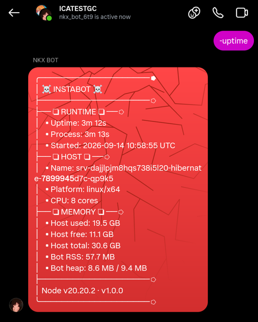
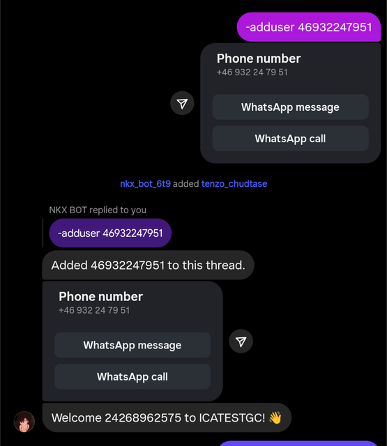
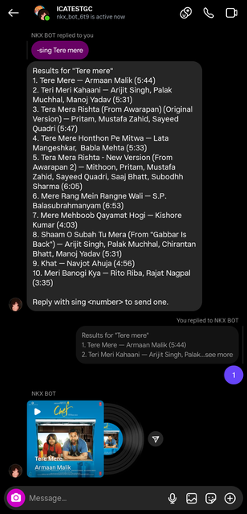

<div align="center">

<a href="https://github.com/frnAlt/InstaBOT">
  
</a>

# ⚡ InstaBOT

**A high-performance, modular Instagram Direct chat bot platform powered by [`ig-chat-api`](https://github.com/lazyneoaz/ig-chat-api) and the Floppa / GoatBot V2 ecosystem.**

Send text, music stickers, animated text effects, photos, audio, and video — with prefix commands,
interactive multi-turn conversations (`onReply`, `onReaction`), roles, cooldowns, canvas image composites, and pluggable custom commands.

[](LICENSE)
[](https://nodejs.org/)
[-3ddc84?style=for-the-badge)](test/run.js)
[](#-complete-commands-catalog)
[](#-transport-modes-direct-ica-vs-remote-server)

[](https://github.com/frnAlt/InstaBOT)
[](https://github.com/frnAlt/InstaBOT/fork)
[](https://github.com/frnAlt/InstaBOT/stargazers)

<p align="center">
  <a href="#-overview">Overview</a> •
  <a href="#-key-features">Features</a> •
  <a href="#-transport-modes-direct-ica-vs-remote-server">Transport Modes</a> •
  <a href="#-screenshots">Screenshots</a> •
  <a href="#-quick-start">Quick Start</a> •
  <a href="#-configuration-reference">Configuration</a> •
  <a href="#-complete-commands-catalog">Commands</a> •
  <a href="#-custom-commands--events">Custom Scripts</a> •
  <a href="#-deployment--production">Deployment</a> •
  <a href="#-testing--verification">Testing</a> •
  <a href="#-credits--attribution">Credits</a>
</p>

---

</div>

## 🌟 Overview

**InstaBOT** combines the battle-tested, modular architecture and rich media capability of **Saifullah Al Neoaz's [`lazyneoaz/Insta-Bot`](https://github.com/lazyneoaz/Insta-Bot)** with the extensive command catalog, event pipeline, interactive state mechanics, and canvas engine from **[`frnAlt/Floppa-Chatbot`](https://github.com/frnAlt/Floppa-Chatbot)** (GoatBot V2).

The bot supports **dual transport execution**:
1. **Mode A (Remote Server):** Ultra-lightweight microservice deployment connecting over HTTP RPC and Server-Sent Events (SSE) to an `ig-chat-api-server` instance via [`auth.js`](auth.js).
2. **Mode B (Direct Native ICA):** Zero-server standalone operation connecting directly to Instagram's WebSocket Realtime (`wss://edge-chat.instagram.com/chat`) via the hardened built-in `ica/` engine using standard session cookies in `account.txt`.

---

## 🔥 Key Features

- ⚡ **Dual Transport Modes:** Run standalone with built-in native ICA (`ica/`) or connect to a remote microservice (`auth.js`).
- 🔄 **Unified Framework Runtime:** Seamlessly executes both **GoatBot V2 handlers** (`onStart`, `onReply`, `onReaction`, `onChat`, `onLoad`) and **lazyneoaz handlers** (`onStart`, `message.reply`, `setReplyHandler`, `setReactionHandler`).
- 💬 **Interactive Multi-Turn Conversations:** Stateful `onReply` and `onReaction` callbacks with 30-minute auto-expiring `TTLMap` memory for games, trivia, and AI chats.
- ✨ **Instagram Power-Up Text Effects:** Send animated Direct effects (`love`, `fire`, `gift`, `celebrate`) with `!effect`.
- 🎭 **Avatar Character Effects:** Send animated Instagram avatar expressions with `!avatarfx`.
- 🎵 **Official Music Stickers & Audio:** Search and attach 20–30s Instagram music stickers (`!music`) or stream full-length MP3 songs (`!sing`).
- 🎥 **Smart Media Pipeline:** Automatic video caption separation ensures preamble captions are never discarded by Instagram Direct.
- 🎨 **Canvas Compositing Engine:** Rich graphic generators (`rank`, `pair`, `marry`, `rip`, `jail`, `pfpframe`, etc.).
- 🛡️ **Stealth & Protection:** Flood tracking, token buckets, and human typing jitter (40–200ms).
- 📊 **Built-In Health Server:** Lightweight HTTP server on port `3000` / `8080` (`/health`) for 24/7 cloud probes (Render, Railway, Fly.io).
- 🧪 **100% Verified Test Suite:** Comprehensive 179-test suite (`npm test`) passing with 0 failures.

---

## 📸 Screenshots

<table>
  <tr>
    <td width="33%" valign="top">
      
      <p align="center"><sub><b>Runtime status</b> — <code>-uptime</code> reports uptime, host, memory and Node version without leaving the chat.</sub></p>
    </td>
    <td width="33%" valign="top">
      
      <p align="center"><sub><b>Membership</b> — <code>-adduser</code> adds a member and the <code>join</code> event greets them automatically.</sub></p>
    </td>
    <td width="33%" valign="top">
      
      <p align="center"><sub><b>Music stickers</b> — <code>-music</code> searches, lists numbered picks and sends the chosen track.</sub></p>
    </td>
  </tr>
</table>

---

## 🚀 Quick Start

### 1. Prerequisites
- **Node.js**: `v18.0.0` or higher (`v20+` LTS recommended). Check with `node -v`.
- **Instagram Account**: A dedicated secondary account for the bot.
- **Session Cookies**: Exported via [Cookie-Editor](https://cookie-editor.cggn.dev/) (see [INSTAGRAM_SETUP.md](INSTAGRAM_SETUP.md)).

### 2. Installation
```bash
# Clone the repository
git clone https://github.com/frnAlt/InstaBOT.git
cd InstaBOT

# Install dependencies
npm install
```

### 3. Authentication & Account Setup
InstaBOT authenticates via browser cookies to ensure safe, session-based connections without entering account passwords on the server.

1. Install the **Cookie-Editor** extension on Chrome, Edge, or Firefox.
2. Log into [instagram.com](https://www.instagram.com) with your bot account.
3. Open Cookie-Editor, click **Export**, and select **Netscape**.
4. Create `account.txt` from the example and paste your exported cookies:
   ```bash
   cp account.txt.example account.txt
   # Paste your cookies into account.txt
   ```
*(For detailed steps and anti-ban recommendations, read [INSTAGRAM_SETUP.md](INSTAGRAM_SETUP.md)).*

### 4. Choose Your Execution Mode

#### ⚡ Mode A: Direct Standalone Realtime ICA (Default / Easiest)
Runs 100% locally with zero external services. Connects directly to Instagram's WebSocket Realtime gateway (`wss://edge-chat.instagram.com/chat`) using the built-in hardened `ica/` engine:
```bash
npm start
```

#### 🌐 Mode B: Remote Microservice (For Cloud Platforms)
Deploy an instance of [`ig-chat-api-server`](https://github.com/lazyneoaz/ig-chat-api-server) and point InstaBOT to it:
```bash
export IG_API_SERVER="https://your-server.onrender.com"
export IG_API_TOKEN="your-secret-token"
npm start
```

---

## ⚙️ Configuration Reference

Configuration is managed via [`config.json`](config.json) (or `config/default.json` and `.env`):

```jsonc
{
  "botName": "InstaBOT",
  "prefix": "-",
  "language": "en",

  // 👑 Bot Administrators: Numeric Instagram User IDs
  // (Admins bypass all cooldowns and can operate bot even when defaultOff is enabled)
  "devUsers": ["36296727311", "49212864825"],
  "adminBot": [],

  // 🔒 Private / Default-Off Mode:
  // When true, ONLY bot admins can operate the bot. Non-admins receive ZERO output
  // (silent drop, no error messages, no responses to replies/comments).
  "defaultOff": true,
  "adminOnly": {
    "enable": true,
    "ignoreCommands": []
  },

  // 🚪 Group Join & Leave Events:
  // Disabled by default to prevent chat clutter. Set "enable": true to activate.
  "welcome": {
    "enable": false,
    "message": "Welcome %1 to %2! 👋",
    "selfMessage": "Thanks for inviting me to %2 💋. Type {prefix}help to see all available commands.",
    "threadIDs": []
  },
  "leave": {
    "enable": false,
    "message": "%1 left %2. 👋",
    "threadIDs": []
  },

  // 🌐 Remote Server Configuration (Mode A)
  "server": {
    "url": "",
    "token": "",
    "timeout": 60000
  },

  // 🎵 Music & Media Settings
  "music": {
    "enable": true,
    "apiUrl": "",
    "apiToken": ""
  },

  "whiteList": { "enable": false, "userIDs": [], "threadIDs": [] },
  "cooldown": { "default": 3 }
}
```

### 🌍 Environment Variables
Any configuration value can be set dynamically in your production environment or `.env` file:

| Variable | Description | Default |
| :--- | :--- | :--- |
| `IG_ADMIN_BOT` | Comma-separated list of Admin Instagram User IDs | `36296727311, 49212864825` |
| `IG_COOKIES` | Session cookie string (overrides `account.txt`) | *empty* |
| `IG_API_SERVER` | Remote `ig-chat-api-server` URL (Mode A) | *empty (uses Mode B)* |
| `IG_API_TOKEN` | Remote server authentication token | *empty* |
| `PREFIX` | Global command trigger prefix | `*` or `-` |
| `PORT` | HTTP health probe & dashboard port | `8080` (or `3000`) |
| `INSTABOT_URL` | Custom external media or music API endpoint | *empty* |
| `INSTABOT_TOKEN` | Bearer token for custom external APIs | *empty* |

---

## 👑 Permission Hierarchy

InstaBOT enforces a 4-tier permission model:
- `0` — **User:** Public utilities, entertainment, AI, and information commands.
- `1` — **Thread Admin (Box Admin):** Group moderation (`-kick`, `-adduser`, thread settings).
- `2` — **Bot Admin:** Configured in `adminBot` (`-ban`, `-unban`, `-whitelist`, `-spamban`).
- `3` — **Bot Owner:** Configured system owners with shell access (`-eval`, `-shell`, `-restart`).

---

## 📚 Complete Commands Catalog

### 🌟 Core Instagram Commands (Saifullah Al Neoaz Base)
| Command | Aliases | Role | Description | Usage |
| :--- | :--- | :---: | :--- | :--- |
| `help` | `h`, `menu` | 0 | Interactive command directory and manual | `-help [cmd]` |
| `ping` | `pong` | 0 | Latency and connection check | `-ping` |
| `uptime` | `up`, `runtime` | 0 | System uptime and memory report | `-uptime` |
| `uid` | `id` | 0 | Retrieve user ID (by handle, reply, or URL) | `-uid [@user]` |
| `info` | `whois`, `profile` | 0 | Instagram profile inspection | `-info [@user]` |
| `pfp` | `pp`, `profilepic` | 0 | Fetch user high-definition avatar | `-pfp [@user]` |
| `echo` | `say` | 0 | Repeat text message | `-echo <text>` |
| `effect` | `fx` | 0 | Animated Instagram text effect | `-effect <fire\|love\|gift\|celebrate> <text>` |
| `avatarfx` | `avfx` | 0 | Animated avatar character effect | `-avatarfx <laugh\|cry\|love> <text>` |
| `music` | `stickermusic`, `sm`, `m` | 0 | Search & send official Instagram music sticker | `-music <song>` |
| `sing` | — | 0 | Search & stream full song audio (MP3) | `-sing <song>` |
| `ai` | `ritchi`, `chatbot` | 0 | Conversational AI with memory (reply to chat) | `-ai <message>` |
| `img` | `image`, `sendimg` | 0 | Send photo attachment from URL | `-img <url>` |
| `anisearch` | `anivid`, `animevid` | 0 | Search & download anime AMV video | `-anisearch <query>` |
| `joke` | `dadjoke` | 0 | Tell random community jokes | `-joke` |
| `roll` | `dice` | 0 | Roll dice with interactive reply picker | `-roll [sides]` |
| `bby` | `simi` | 0 | Interactive conversational chatbot | `-bby <msg>` |
| `unsend` | `del` | 0 | Unsend bot message (reply to target) | `-unsend` |
| `admin` | `adminbot` | 2 | Add, remove, or list bot admins | `-admin <add\|remove\|list>` |
| `ban` | `unban` | 2 | Ban or unban user from bot globally | `-ban <@user\|id>` |
| `adduser` | `addmember` | 1 | Add user to current group thread | `-adduser <@user\|id>` |
| `removeuser` | `kick` | 1 | Remove participant from thread | `-removeuser <@user>` |
| `whitelist` | `wl` | 2 | Manage allowed threads and users | `-whitelist <add\|remove\|list>` |
| `prefix` | `setprefix` | 0/2 | View or change command prefix | `-prefix [newPrefix]` |
| `avatar` | `setavatar` | 2 | Update bot account profile picture | `-avatar (reply with image)` |
| `bio` | `setbio` | 2 | Update bot account biography | `-bio <text>` |
| `cmd` | `command` | 2 | Load, reload, install, or inspect scripts | `-cmd <list\|load\|reload\|install>` |
| `eval` | `ev`, `js` | 2 | Evaluate JavaScript in bot runtime | `-eval <code>` |
| `shell` | `sh`, `exec` | 2 | Execute shell command on host | `-shell <command>` |

---

### 🤖 Artificial Intelligence & Generative Models
| Command | Aliases | Description | Usage |
| :--- | :--- | :--- | :--- |
| `claude` | `cld` | Multi-modal reasoning via Anthropic Claude 3 | `-claude <prompt>` |
| `gemini` | `bard` | Query Google Gemini multimodal AI | `-gemini <prompt>` |
| `metaai` | `llama` | Conversational Meta LLaMA model | `-metaai <prompt>` |
| `dalle3` | `dalle` | OpenAI DALL-E 3 image generation | `-dalle3 <prompt>` |
| `imagen3` | `imagen4` | Google Imagen text-to-image generator | `-imagen3 <prompt>` |
| `flux` | `fluxdev`, `flux2` | Photorealistic image synthesis via Flux | `-flux <prompt>` |
| `genx` | `art`, `creart` | Multi-engine artistic image creator | `-genx <prompt>` |
| `nijix` | `niji` | High-definition anime image generator | `-nijix <prompt>` |
| `veo` | `txt2video` | AI Text-to-Video generation | `-veo <prompt>` |
| `imggen` | `img` | Fast multi-model AI image creator | `-imggen <prompt>` |
| `aiphoto` | `photoai` | Enhance and synthesize realistic portraits | `-aiphoto <prompt>` |
| `removebg` | `nobg` | Background removal with transparent PNG | `-removebg (reply)` |
| `autotalk` | `bot` | Context-aware automated responder | Auto-triggered |

---

### 🎬 Media, Video & Social Downloaders
| Command | Aliases | Description | Usage |
| :--- | :--- | :--- | :--- |
| `video` | `ytv` | Search and stream YouTube video clips | `-video <title>` |
| `tiktok` | `tt` | Download TikTok video clips without watermark | `-tiktok <url>` |
| `pinterest` | `pins`, `pinterestdl` | Search and download Pinterest HD pictures | `-pinterest <search>` |
| `movies` | `imdb` | Movie & TV show information with posters | `-movies <title>` |
| `anime` | `ani`, `mal` | Anime synopsis, scores, and art via MyAnimeList | `-anime <query>` |
| `manga` | `manhwa` | Manga details and chapter summaries | `-manga <query>` |
| `alldl` | `dl` | Universal video downloader across social media | `-alldl <url>` |
| `ytb` | `youtube` | Direct YouTube downloader with resolution picker | `-ytb <url>` |
| `shazam` | `findsong` | Identify song from attached audio/video | `-shazam (reply)` |
| `emojimix` | `mixemoji` | Google Emoji Kitchen composite stickers | `-emojimix 😭 🤣` |
| `meme` | `dankmeme` | Fetch random community memes | `-meme` |
| `imgbb` | `upload` | Upload images directly to ImgBB storage | `-imgbb (reply)` |
| `imgur` | `imgurl` | Upload media to Imgur storage | `-imgur (reply)` |
| `catbox` | `cb` | Upload files to Catbox storage | `-catbox (reply)` |
| `say` | `tts` | Text-to-speech voice notes for Direct | `-say <text>` |
| `pfpframe` | `frame` | Generate glowing neon/gold framed avatar cards | `-pfpframe @user` |

---

### 🎲 Economy, Games & Canvas Graphics
| Command | Aliases | Description | Usage |
| :--- | :--- | :--- | :--- |
| `bank` | `bal` | Check coin balance and bank deposits | `-bank` |
| `daily` | `claim` | Claim daily economy coins reward | `-daily` |
| `economy` | `eco`, `pay` | Transfer currency to other members | `-economy pay @user <amt>` |
| `work` | `job` | Work hourly jobs to earn coins | `-work` |
| `top` | `leaderboard` | View richest users in economy ranking | `-top` |
| `spin` | `wheel` | Spin fortune prize wheel | `-spin <bet>` |
| `roll` | `gamble` | Gamble dice for 2x–5x payouts | `-roll <bet>` |
| `coinflip` | `cf`, `flip` | Double-or-nothing coin toss | `-coinflip <heads\|tails> <amt>` |
| `slot` | `slots` | Casino slot machine spin | `-slot <bet>` |
| `mines` | `minesweeper` | 5x5 Minefield cashout game | `-mines <bet>` |
| `richroll` | `rr` | High-stakes fortune roll with multipliers | `-richroll <bet>` |
| `wordgame` | `scramble` | Unscramble the hidden word for coins | `-wordgame` |
| `mathquiz` | `math` | Speed mental arithmetic challenge | `-mathquiz` |
| `guessnumber`| `guessnum`, `guessn` | Secret number guessing game (1-100) | `-guessnumber` |
| `quiz` | `trivia` | Interactive trivia quiz challenge | `-quiz` |
| `marry` | `wedding` | Propose and issue marriage certificates | `-marry @user` |
| `ship` | `pair` | Love compatibility calculator and composite card | `-ship @user` |
| `hug` | `cuddle` | Dual PFP canvas cuddle graphic | `-hug @user` |
| `kiss` | `smooch` | Romantic canvas composite kiss image | `-kiss @user` |
| `slap` | `hit` | Slap target user with canvas image | `-slap @user` |
| `jail` | `wanted` | Generate Wanted/Jail bounty posters | `-jail @user` |
| `rip` | `tomb` | Generate gravestone tribute memes | `-rip @user` |
| `gay` | `howgay` | Dual-avatar rainbow card | `-gay @user` |
| `rps` | `rockpaperscissors` | Play Rock-Paper-Scissors against bot | `-rps <choice>` |
| `dice` | `d` | Roll virtual polyhedral dice | `-dice` |

---

### 🛠️ Moderation, Utilities & System Suite
| Command | Aliases | Role | Description | Usage |
| :--- | :--- | :---: | :--- | :--- |
| `weather` | `forecast` | 0 | Live global weather conditions | `-weather <city>` |
| `translate` | `trans` | 0 | Translate text into any language | `-translate <lang> <text>` |
| `calc` | `calculate` | 0 | Evaluate math expressions | `-calc <expr>` |
| `time` | `clock` | 0 | Display world timezone clock | `-time [zone]` |
| `moon` | `moonphase` | 0 | Lunar phase calendar for any date | `-moon [date]` |
| `tinyurl` | `shorturl` | 0 | Shorten links using TinyURL APIs | `-tinyurl <url>` |
| `quran` | `surah` | 0 | Read Holy Quran verses with translation | `-quran <surah:ayah>` |
| `fancy` | `font` | 0 | Convert text to 30+ stylized Unicode fonts | `-fancy <text>` |
| `github` | `gh` | 0 | Query GitHub users and repository statistics | `-github <user\|repo>` |
| `screenshot` | `webshot` | 0 | Capture full rendered web page snapshot | `-screenshot <url>` |
| `quote` | `q` | 0 | Inspirational quotes & canvas cards | `-quote` |
| `48law` | `lawsofpower` | 0 | 48 Laws of Power wisdom quotes | `-48law [1-48]` |
| `choose` | `pick` | 0 | Randomly choose between options | `-choose opt1 \| opt2` |
| `rules` | `rule` | 0 | Display thread rules | `-rules` |
| `busy` | `afk` | 0 | Set automatic AFK status when away | `-busy [reason]` |
| `filter` | `badwords` | 1 | Blacklist bad words in thread | `-filter <add\|list>` |
| `warn` | `warning` | 1 | Issue warning strikes to members | `-warn @user [reason]` |
| `thread` | `group` | 1 | Manage thread title, photo, and settings | `-thread` |
| `spamban` | `antispam` | 2 | Manage users banned by spam flood tracker | `-spamban <list\|unban>` |
| `safeguard` | `health` | 2 | RAM allocation, event loop, and telemetry | `-safeguard` |
| `perf` | `benchmark` | 2 | System latency and CPU benchmark | `-perf` |
| `stats` | `statistics` | 0 | Command invocation statistics | `-stats` |
| `restart` | `reboot` | 3 | Safely restart bot process (Owner only) | `-restart` |

---

## 🛠️ Custom Commands & Events

Drop any `.js` file directly into `commands/` (or `events/`) — it is loaded automatically on boot.

### 1. Command Template
```javascript
module.exports = {
  config: {
    name: "hello",
    aliases: ["hi"],
    author: "YourName",
    category: "custom",
    cooldown: 3,
    role: 0,
    description: "Say hello",
    usage: "{p}hello <name>"
  },

  onStart: async function ({ message, args }) {
    return message.reply(`Hello ${args.join(" ") || "world"}! 👋`);
  }
};
```

### 2. Interactive Reply Handler Example
```javascript
module.exports = {
  config: {
    name: "roll",
    aliases: ["dice"],
    category: "games",
    cooldown: 3,
    role: 0,
    description: "Roll dice and reply to save your favorite"
  },

  onStart: async function ({ message, args, setReplyHandler, usersData }) {
    const sides = Number(args[0]) > 1 ? Math.floor(Number(args[0])) : 6;
    const value = 1 + Math.floor(Math.random() * sides);

    const sent = await message.reply(`Rolled a d${sides}: ${value}\nReply "pick <n>" to save a favourite.`);

    setReplyHandler(async ({ event: replyEvent, message: replyMessage }) => {
      const [action, n] = String(replyEvent.body || "").trim().split(/\s+/);
      if (action !== "pick" || !/^\d+$/.test(n)) return;
      usersData.update(replyEvent.senderID, { data: { favourite: Number(n) } });
      await replyMessage.reply(`Saved your favourite number: ${n}!`);
    }, sent && sent.messageID);
  }
};
```

### 3. Custom Event Handler Template (`events/myEvent.js`)
```javascript
module.exports = {
  config: {
    name: "logActivity",
    // Listen to specific types: "message", "message_reply", "message_reaction", "join", "leave"
    eventType: ["message", "message_reaction"],
    author: "YourName"
  },

  onStart: async function ({ event, message, threadData, usersData, config }) {
    if (event.type === "message_reaction") {
      console.log(`User ${event.senderID} reacted ${event.reaction} in thread ${event.threadID}`);
    }
  }
};
```

### 4. Handler Context Parameters
Every `onStart`, `onReply`, and `onReaction` handler receives a rich contextual object:
- `api` — Raw `ig-chat-api` instance with methods (`sendMessage`, `sendImage`, `sendAudio`, `sendMusic`, `sendAvatarTextEffect`, `unsendMessage`, etc.).
- `message` — Standardized message interface with helpers: `message.reply(text)`, `message.react(emoji)`, `message.sendImage(url)`.
- `event` — Normalized Instagram incoming event (`type`, `threadID`, `messageID`, `senderID`, `body`, `attachments`, `messageReply`).
- `args` — Array of string arguments following the command name.
- `role` — Caller permission level (`0` = User, `1` = Thread Admin, `2` = Bot Admin, `3` = Bot Owner).
- `usersData` & `threadsData` — Persistent Key-Value & Database storage drivers (`get`, `set`, `update`, `ensure`).
- `setReplyHandler(fn, messageID)` — Arm a stateful callback when a user replies to the bot's message.
- `setReactionHandler(fn, messageID)` — Arm a stateful callback when a user reacts with an emoji.

---

## 🚢 Deployment & Production

### PM2 (VPS / Dedicated Server)
```bash
npm install -g pm2
pm2 start index.js --name "instabot"
pm2 save
pm2 startup
```

### Docker
```bash
docker build -t instabot .
docker run -d -p 8080:8080 --name instabot-app instabot
```

### Cloud Health Probes
InstaBOT automatically serves health checks for cloud platforms (Render, Railway, Fly.io, AWS ECS):
- `GET /health` — Returns status JSON `{ "ok": true, "online": true, "commands": 196, "events": 4 }`
- `GET /` — Realtime dashboard

---

## 🧪 Testing & Verification

InstaBOT features a comprehensive zero-external-dependency test runner:

```bash
npm test
```

```text
  ok  - uid: reports throttling instead of 'Could not find'
  ok  - message: music routes to sendMusic with the track
  ok  - anisearch: searches, downloads and sends the video bytes
  ok  - eval: evaluates an expression for a bot admin
  ok  - admin: configured admin accounts can operate bot in admin-only mode
  ok  - events: silently ignores non-admins when bot is turned off
  ...
  179/179 tests passed (100%)
```

---

## 🔒 Security & Best Practices

1. **Keep `account.txt` Secret:** Never commit session cookies or passwords. `.gitignore` ignores `account.txt`, `session.json`, and `.env`.
2. **Never Commit Tokens:** Keep `IG_API_TOKEN` in host environment secrets.
3. **Restrict Bot Admin Rights:** Keep `adminBot` limited to trusted accounts; dangerous commands (`eval`, `shell`, `restart`) are strictly gated by permission checks.

---

## 👨‍💻 Credits & Attribution

- **Developer & Lead Architect:**
  - [**frnAlt**](https://github.com/frnAlt) — Lead developer, architecture redesign, and Floppa ecosystem integration.
- **Original Base Architecture & `ig-chat-api` Author:**
  - [**Saifullah Al Neoaz (lazyneoaz)**](https://github.com/lazyneoaz) — Creator of [Insta-Bot](https://github.com/lazyneoaz/Insta-Bot), [`ig-chat-api`](https://github.com/lazyneoaz/ig-chat-api), and [`ig-chat-api-server`](https://github.com/lazyneoaz/ig-chat-api-server).
- **Architecture Inspiration & Ecosystem:**
  - [**Floppa-Chatbot / GoatBot V2**](https://github.com/frnAlt/Floppa-Chatbot)
  - [**Gtajisan**](https://github.com/Gtajisan)
- **Contributors:**
  - **NZ R.** — AI engine (`ai`), `adduser`, `removeuser`, and GoatBot-style runtime evaluations.

---

<div align="center">
  <sub>Developed by <b>frnAlt</b> • Based on original architecture by <b>Saifullah Al Neoaz (lazyneoaz)</b></sub><br/>
  <sub>⭐ If you find this project useful, please consider giving it a star on GitHub! ⭐</sub>
</div>
